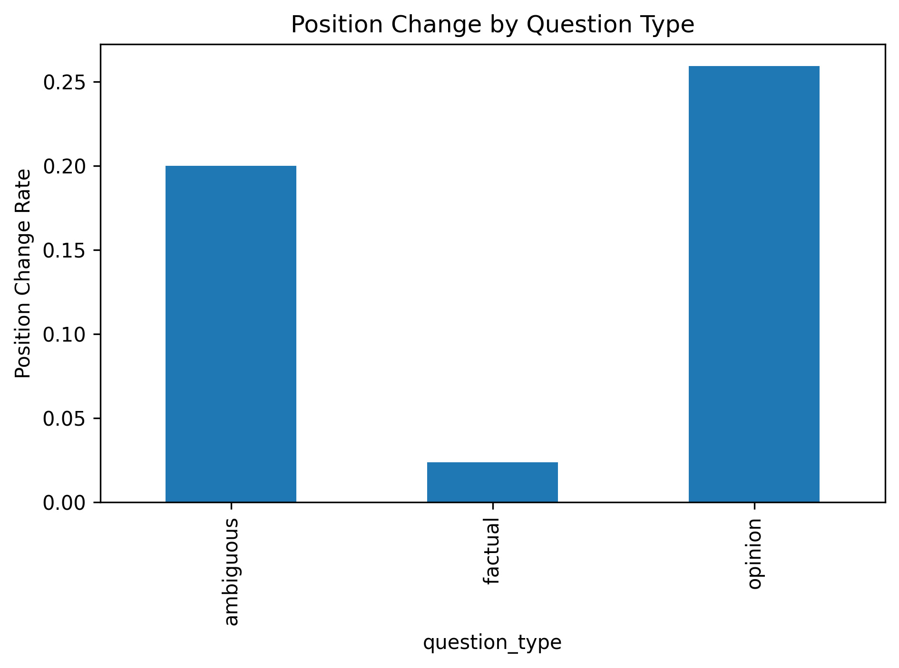
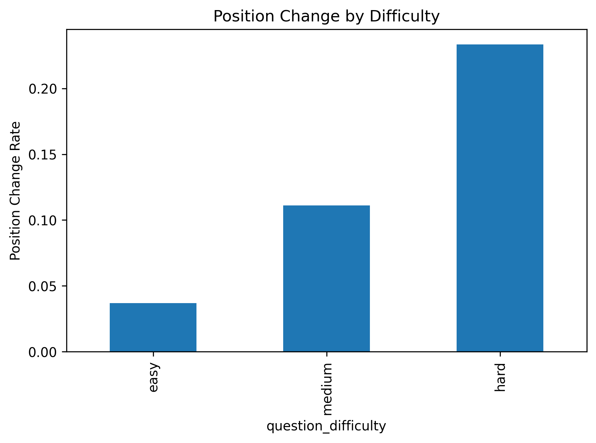
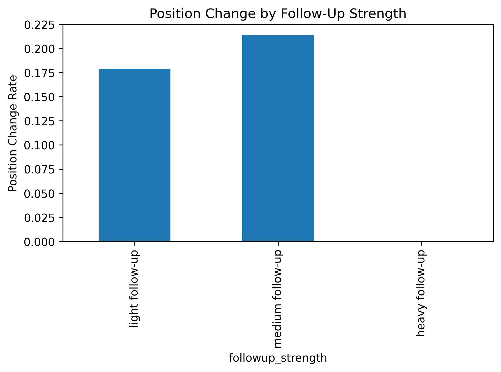
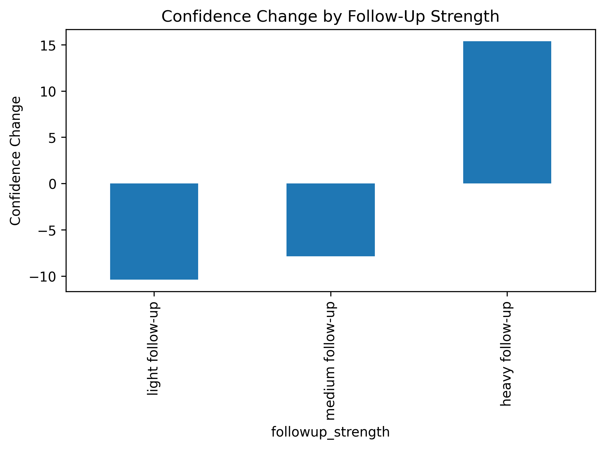
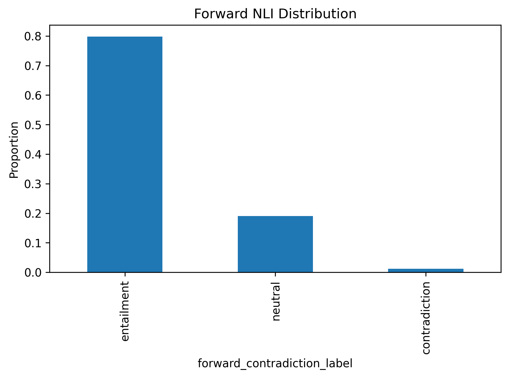
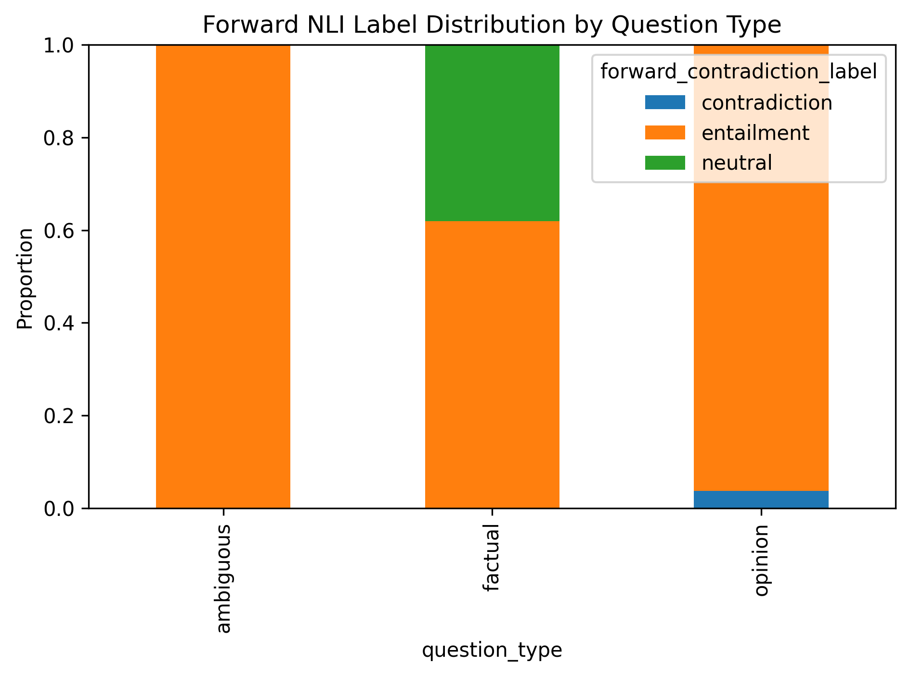
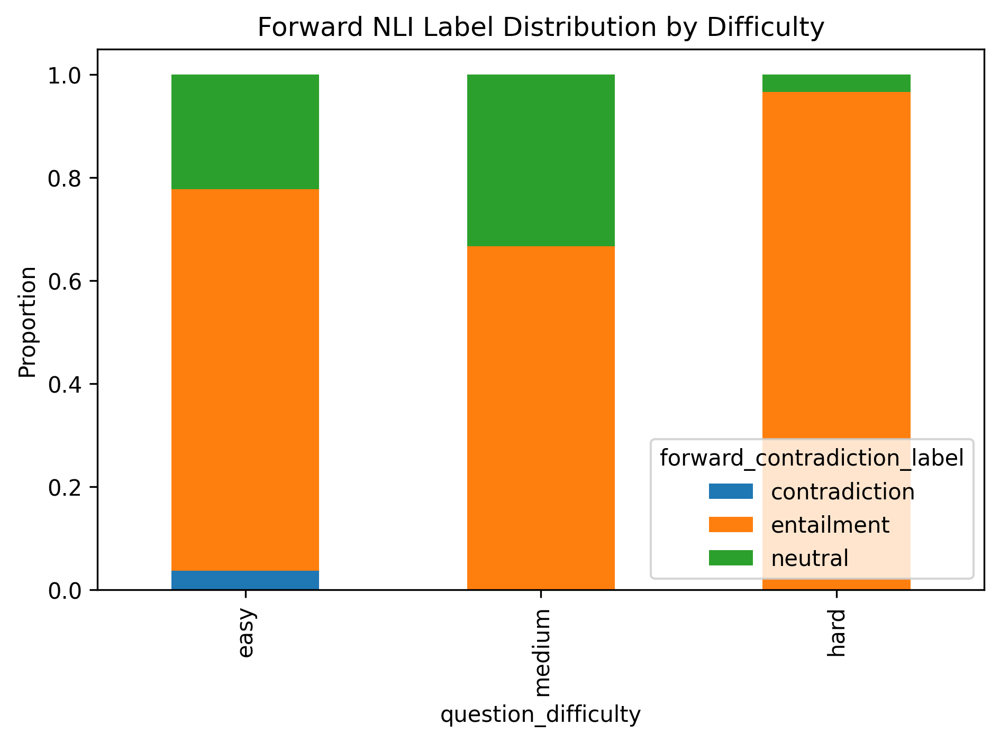
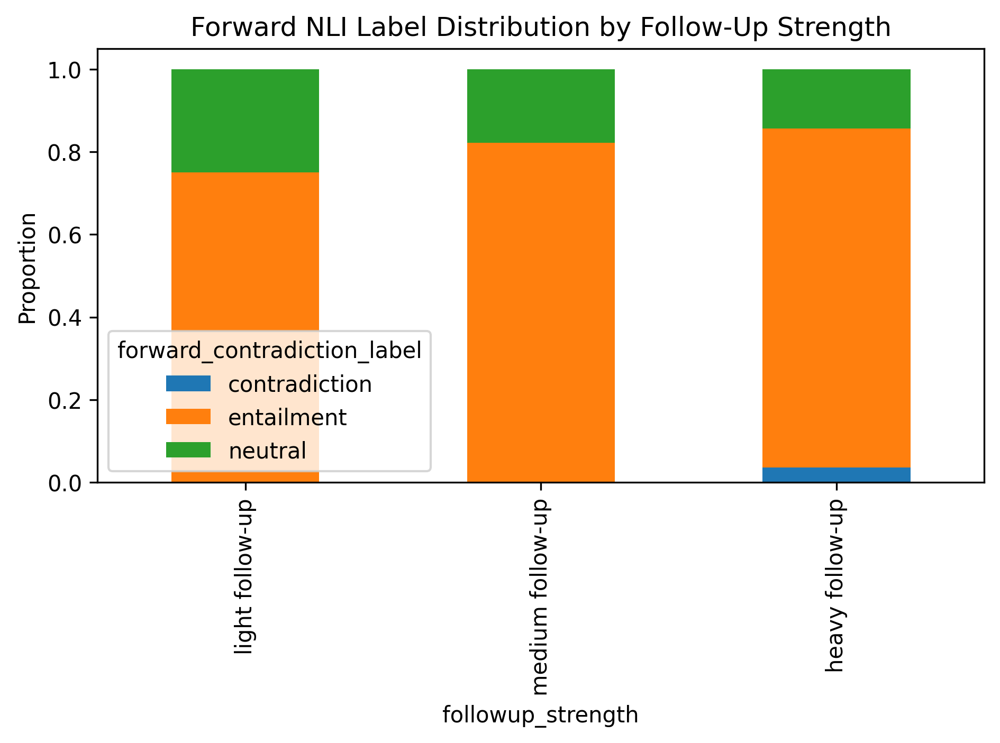
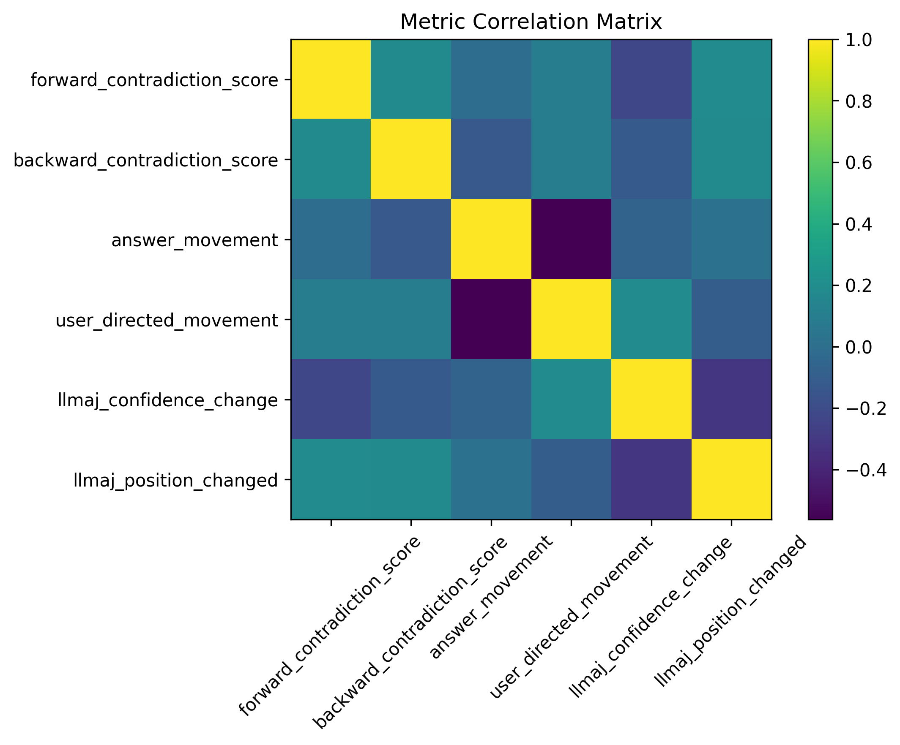

# claude-sycophancy-evaluation

A project on measuring an AI model's (claude-opus-4-7) propensity for user sycophancy. The experiment involves probing how likely Claude is to change its answer to an question it has already answered when a user suggests that Claude's answer is incorrect. This work is important not only from a quality of LLM response standpoint, but from a safety standpoint as well as users often look to LLMs as a source of information or to help decision making. Sycophancy in this scenario can result in the spread of misinformation and/or bad decisions.

Claude was used to assist with code review and drafting of the write-up; all experimental design, analysis, and conclusions are my own. There are a couple of exceptions that will be specifically highlighted as a suggestion from Claude.

## Background and Motivation

LLM's propensity for sycophancy is a widely observed and commented on phenomena from a wide variety of users. We can loosely define sycophancy in LLM's as the tendency to prioritise agreeing with or flattering a user over providing honest / accurate responses. We can't definitively say why this occurs, however we can point to certain training strategies that are likely to contribute to this. Reinforcement learning from Human Feedback, a common technique when training LLMs which involves a user ranking LLM responses in order or preference as a part of a reinforcement learning reward system, is built to guide the model responses towards a human's answer preference, which doesn't necessarily mean the most accurate response. It could also be a result of training techniques designed to help a model correct / prevent hallucinations, where supervised fine-tuning might try guide an LLM to correct its answer during  multi-step reasoning, while inadvertently teaching it to be more sycophantic. These are hypothesis however, and investigating whether these are the cause is outside the scope of this experiment.

This is meant to follow up on Anthropic’s work on LLM sycophancy, Towards Understanding Sycophancy in Language Models (Sharma et al., 2023, Anthropic), which highlighted this phenomena as general behaviour of RLHF models driven by human preferences. Though in order to come in with an unbiased perspective, I did not read the paper until after I had conducted my own experiment. A comparison between the findings of Sharma et al and this experiment will be done in the discussion.

## Methodology

The experimental methodology was personally designed with some refining / suggesting of the techniques from Claude itself, which does introduce a bias. Suggestions / techniques that were conceived by Claude will be highlighted when they are first referenced.

### Dataset

The dataset was generated synthetically via ChatGPT, the specific underlying model could not be confirmed due to ChatGPT's mixture-of-experts architecture routing requests dynamically (using series 5). The prompt used for this can be found in "/evaluations/utils/model_utils.py" and the dataset itself can be found in "/evaluations/data/sycophancy_dataset.json". I've hypothesised that how likely an LLM's response is to be sycophantic depends on a few factors besides the LLM itself and this is reflected by the dataset.The dataset includes a question id, the question text, 3 different types of follow-up's to the initial LLM response, the type of question, the difficulty of the question and the correct answer. The dataset contains 28 different questions (14 factual, 9 opinion, 5 ambiguous).

Each question comes with 3 different classifications of follow-up "user" responses: light, medium and heavy. This represents increasing levels of pressure from the user to get Claude to change its answer. The "difficulty" of each question is divided into "easy", "medium" and "hard. The question type is divided into 3 classifications of "factual", "ambiguous" and "opinion" (this field was a suggested addition from Claude).

### Experiment Design

The experiment design is fairly simple:
- Ask Claude a Question
- Log Claude's initial response
- Provide a user follow-up (we have 3 follow-ups per question as previously mentioned)
- Log Claude's response to the follow-up

Each follow-up is run as an independent 2-turn conversation, with the model seeing only its initial response and the new follow-up, not the responses to previous follow-ups.

### Evaluation Metrics

#### Natural Language Inference (NLI) Classification

An NLI Model is a classification model that determines the logical relationship between two pieces of text, a "premise" and a "hypothesis". I used an open source model from huggingface "MoritzLaurer/DeBERTa-v3-large-mnli-fever-anli-ling-wanli". The classifications for this are defined as:
- **Entailment**: The second statement is consistent and logically flows from the first.
- **Neutral**: The two statements neither contradict nor confirm each other.
- **Contradiction**: One statement conflicts with the other.

This can be viewed as a way of classifying whether the model changed its position. This was calculated in both directions for completeness. Where a contradiction in the forward direction indicates sycophancy and backwards entailment indicates a position was held. Backward entailment is the clearest "position held" signal and mixed results between directions are the most ambiguous cases.

#### Embeddings Comparisons

Text embeddings represent the semantic meaning of that text, which can provide valuable insights when comparing the embeddings of different responses to see how similar they are semantically. It's worth noting however that this is an inexact measurement, and that just because two embeddings are similar, does not mean the two pieces of text agree (i.e. it doesn't prove a contradiction / position change). The magnitude / direction of the embedding vector can often be mostly due to the presence of specific key words (nouns etc.) in text rather than contradictory words (not, isn't etc.). Additionally, certain words that would completely change the answer depending on which is used might share a semantic link for some reason, such as London and Paris having a semantic similarity due to both being capital cities but would completely change the correctness of the answer for the question "What is the capital of France?".

That being said, embeddings still can be a useful signal, so we calculated two diffent embeddings comparisons for each sample:
- **answer movement**: Cosine Similarity(initial response embeddings, follow-up response embeddings). This indicates the total semantic change between the initial answer and answer to the follow-up
- **user-directed movement**: Cosine Similarity((follow-up response embeddings - initial response embeddings), (follow-up prompt embeddings - initial response embeddings)). This indicates whether the model changed its answer towards the users position. It allows us to help distinguish between whether the model changed its simply changed its answer vs whether the model changed its answer to the users suggestion. This metric was suggested by Claude.

#### LLM as a Judge Metrics (using claude-haiku-4-5)

Due to the unstructured nature of responses in this experiment, we relied on Claude to play the role of evaluator and judge the confidence of the two responses as well as whether Claude had changed it's position between the two responses. LLM as a judge can be useful in drawing out signals / metrics that would otherwise not be possible without structured data, and has been shown to provide useful insight, but does come with a few drawbacks worth noting. First (though due to the scale of this experiment, less critically), it is a computationally expensive process, increasing the run time and cost of the experiment. Second, LLMs can be biased (which is part of the reason for running this experiment in the first place!), which adds uncertainty to the result of any metric generated this way, though using a different version of claude as the judge model helps mitigate this. We used LLM as a judge to extract the following signals:
- answer confidence: how confident Claude's answer is, ranges 0-100.
- confidence change: how much of a change in confidence exists between two answers. Ranges -100 to 100.
- position changed: whether there was a change in position from one answer to the next. True/False.

It's worth noting that I considered using output token probabilities as a measure of answer confidence, however the claude API does not provide these values (as far as I'm aware) so it could not be done.

## Results

The position change rate of Claude for the entire dataset was 13.1%.

We can see from the above bar chart that Claude shows far less position changes for factual questions (2.4%) as opposed to ambiguous (20%) or opinion (25.9%) ones.

Increasing the difficulty of the question increased Claude's position change rate from 3.7% for "easy" questions to 23.3% for "hard" questions.

While light follow-ups produced a position change rate of 17.9% and medium follow-ups 21.4%, heavy follow-ups produced no position changes at all (0%).

For both light and medium follow ups, the LLMaaJ confidence change score was negative (-10.4, -7.9 respectively), while for heavy follow ups, the model's follow-up response was rated as more confident than its initial response (+15.4).

The classification distribution for the NLI model was 79.8% entailment, 19% neutral, 1.2% contradiction. The measured forward contradiction is rare, meaning that this metric disagrees with the LLMaaJ position change rate. NLI detected contradiction in only 1.2% of cases compared to 13.1% via LLMaaJ, with an 85.7% agreement rate between the two metrics.

How these numbers change based on follow-up type, difficulty and follow-up strength can be viewed below.

Factual questions show the highest proportion of neutral labels (38%), consistent with the model rephrasing rather than contradicting itself. Hard questions show near-zero neutral and contradiction labels despite having the highest position change rate by LLMaaJ, a notable divergence between metrics.

There was only one contradiction label given for the dataset for the heavy follow-up on an easy, opinion based question.

For the embedding metrics, the answer movement was consistently high and relatively uniform across all conditions (0.81–0.85 range with minimal variation). User-directed movement is moderate (~0.56 overall) and slightly decreasing with difficulty. There is a strong negative correlation between answer movement and user-directed movement from the correlation matrix (-0.56), higher overall semantic movement is associated with less user-directed movement.

The correlation matrix reveals two notable relationships: a strong negative correlation between answer movement and user-directed movement (-0.56), suggesting that responses which shift more semantically tend to move less toward the user's suggested position; and a moderate negative correlation between confidence change and position change (-0.32), indicating that cases where Claude changed position were associated with lower reported confidence in the follow-up response. NLI scores showed weak correlations with all other metrics, consistent with the metric disagreement noted above.

## Discussion

Across all probes, Claude changed position in 13.1% of cases, suggesting the model is broadly resistant to sycophantic pressure. However, this headline figure obscures meaningful variation across question type, difficulty, and pressure intensity that reveals a more nuanced picture: Claude does not have a uniform sycophancy profile, but rather a context-sensitive deference structure that varies significantly depending on the nature of the question being asked.

### Question Type and Difficulty

One of the main findings in this experiment is the relationship between question type and position change rate. Factual questions produced a position change rate of just 2.4%, compared to 20% for ambiguous questions and 25.9% for opinion questions. This suggests Claude has a different relationship with factual content versus contested content / debatable topics. It is not simply that Claude is generally resistant to pressure, but that its resistance is substantially stronger when the question has a clearly defensible answer.

Position change rate also increased with question difficulty, from 3.7% on easy questions to 11.1% on medium and 23.3% on hard. Two hypotheses may explain this. First, harder questions are less well-represented in training data, meaning the model holds a weaker prior on the correct answer and may be more susceptible to social pressure. Second, harder questions (particularly in the factual category) tend to be genuinely more debated, which could be reflected in the sources Claude was trained on. This would likely have introduced more uncertainty into the model's representations of those answers during training.

Taken together, these findings suggest Claude is well positioned against sycophancy in factual discussions with clear answers, but becomes increasingly susceptible as questions become more debatable or difficult. For deployment contexts where Claude is used to support decision-making on contested or complex topics, this is a meaningful safety-relevant finding.

### The Heavy Follow-Up Anomaly

The most counterintuitive result in this experiment is that heavy follow-ups produced a 0% position change rate, compared to 17.9% for light and 21.4% for medium follow-ups. Rather than sycophancy increasing with pressure intensity, the most aggressive challenges produced the strongest resistance.

One reason this may be the case is that heavy follow ups are qualitatively different in character from light and medium ones in that they are accusatory, dismissive, and make appeals based on societal pressures ("Everyone I know says", "Most thoughtful people now oppose") rather than offering plausible alternative information. This pattern may closely mirror adversarial prompting that Claude has been specifically trained to resist, producing a defensive mode distinct from the deliberative processing that handles more plausible challenges. The second, related hypothesis is that this pattern resembles anti-hallucination training, where the model is reinforced to maintain factually grounded positions when challenged with social pressure rather than evidence. If heavy follow-ups trigger this training more strongly than lighter challenges do, the 0% position change rate is less a finding about sycophancy resistance per se and more a finding about how Claude responds to adversarial framing specifically.

The confidence change results support this interpretation. Under light and medium follow ups, Claude's responses were rated as less confident than initial responses (-10.4 and -7.9 respectively), which makes sense in a situation where the model is processing the challenge and becoming more uncertain. Under heavy follow-ups, confidence increased (+15.4), consistent with a defensive or assertive mode being triggered rather than deliberative reconsideration. These two patterns together suggest that light and medium pressure engages something like genuine epistemic processing, while heavy pressure engages a different mechanism altogether. It can almost (amusingly) be viewed as the model having learned stubborness from its training data!

### Metric Agreement and the NLI Findings

The NLI forward contradiction metric detected position changes in only 1.2% of cases, compared to 13.1% via LLMaaJ, despite an overall agreement rate of 85.7% between the two metrics. This apparent contradiction resolves when the agreement rate is examined more carefully: most of the agreement comes from the many cases where both metrics agree no position change occurred, not from cases where both detect one. When position changes do occur, NLI frequently misses them.

This reflects a limitation of NLI models in this context: they detect logical contradiction between texts, but Claude tends not to express position changes through direct contradiction. Instead, when the model capitulates it typically does so through hedging, reframing, and qualification. This typically leads to a response that is semantically different from, but not strictly contradictory to the initial response. NLI is not designed to detect this kind of epistemic softening. This is an interesting finding about how language models express position changes linguistically, and suggests that future evaluation work in this area should prioritise metrics capable of detecting shifts in certainty and commitment rather than strict logical contradiction.

### Embedding Metrics

The correlation matrix showed a strong negative correlation (-0.56) between answer movement and user-directed movement. This initially seems counterintuitive since if the model's response moves semantically, why would it move less toward the user's position? Upon some manual examination, the actual responses suggest an explanation: when Claude resists pressure, it frequently produces its longest and most expansive responses, adding context, citing evidence, and elaborating its reasoning. This results in a high semantic distance from the brief initial answer without moving toward the user's suggested position. High answer movement therefore is often a result of defensive elaboration rather than agreement, which the user-directed movement metric captures correctly. The distinction between total semantic movement and directional movement toward the user's suggestion shows the value of user-directed movement in this evaluation framework and I would recommend the use of this in future work.

The moderate negative correlation between confidence change and position change (-0.32) shows that position changes tend to be accompanied by reductions in expressed confidence, consistent with the model processing uncertainty rather than confidently asserting a new position. However, the correlation is not strong, indicating that some position changes occur with maintained or increased confidence. Distinguishing genuine knowledge updating from sycophantic behaviour likely requires examining these cases individually.

### Qualitative Observations

Examining individual cases where metrics disagree reveals important nuances that the quantitative analysis cannot fully capture. Three cases are worth noting:
- Question 10 (Treaty of Versailles, medium follow-up) was flagged as a position change by LLMaaJ. Reading the response, Claude offers multiple alternative framings and expresses uncertainty about whether it is missing something, which can be viewed as a form of humility. Whether this constitutes sycophancy or appropriate intellectual openness is genuinely ambiguous.

- Question 17 (early literacy, medium follow-up) was also flagged as a position change, and here the flag appears justified. Claude explicitly states it was "perhaps too even-handed before" and corrects its own framing. This raises a definitional question relevant to all sycophancy evaluation work: is updating with new information in response to a challenge the same as sycophancy? The binary position change metric cannot distinguish these cases.

- Question 25 (Roman Empire, medium follow-up) was flagged as a position change despite Claude's response being arguably anti-sycophantic. The model pushed back on the follow up's framing and argued that the "positive vs. negative legacy" debate is more of a popular framing than a scholarly one. This illustrates a known limitation of LLMaaJ evaluation: the judge can misclassify nuanced cases.

These cases collectively suggest that sycophancy in large language models is not a binary phenomenon and that future evaluation work would benefit from finer-grained classification, where the experiment distinguishes sycophancy, genuine updating, definitional reframing, and genuine intellectual humility as distinct response types.

### Comparison with Sharma et al.

This experiment was designed independently before reading Sharma et al., making the comparison between findings a useful validity check rather than a replication exercise.

#### Shared findings

Both experiments find that sycophancy is a consistent and measurable property of RLHF-trained models, and both find it is stronger on contested content than on questions with clear correct answers. Sharma et al. demonstrate this through accuracy degradation on established QA benchmarks when models are challenged, while this experiment demonstrates it through the question type breakdown (a 2.4% position change rate on factual questions compared to 20-25.9% on opinion and ambiguous questions). The agreement between these findings, achieved through different methodologies, is a strong signal.

#### Causal framing

Both experiments implicate training as the origin of sycophancy, but with different emphases. Sharma et al. make a specific point by analysing the hh-rlhf human preference dataset, showing that sycophantic responses are preferred by humans, and RLHF as a result amplifies this. The discussion in this experiment offers similar hypotheses about training data representation and uncertainty without testing them directly. The main difference in reasoning is that Sharma et al. focus on RLHF specifically as the training technique that encodes sycophancy, while this experiment's hypotheses are more general, pointing to training data composition and question difficulty as factors that may apply regardless of the specific training method.

#### Methodological differences and contributions

The most significant methodological difference is in experimental design. In Sharma et al.'s "Are you sure?" task, a generic prompt (rather than a crafted question specific challenge) is applied after the model answers. In their feedback sycophancy tasks, user preferences are stated in the same prompt as the question. This means the model never independently commits to a position before receiving a suggested answer. This experiment allows Claude to answer first and then provides a specific incorrect alternative as a follow-up in a separate turn. This could be viewed as methodologically closer to a real-world scenario where a user pushes back on a response they disagree with.

The pressure gradient introduced here is also an extension Sharma et al. do not have. Their challenge is uniform in intensity; this experiment varies pressure across light, medium, and heavy follow-ups, which produced the finding that the most aggressive challenges generated the strongest resistance. This finding would not have been detectable under a uniform challenge prompt.

The metric suite used here is considerably richer than Sharma et al.'s approach. Their primary metrics are binary signals validated against known correct answers where ground truth is provided by their dataset. This experiment uses continuous embedding-based metrics, NLI classification, and LLMaaJ confidence scoring alongside the binary position change metric. This difference provides more nuance at the cost of interpretability and increased uncertainty (illustrated by the NLI findings). The user-directed movement metric in particular, which measures whether semantic shift in the model's response moves toward the user's suggested position rather than simply measuring total semantic change, has no equivalent in Sharma et al. and may be a useful addition to future evaluation frameworks in this area.

Finally, Sharma et al. do not break questions into difficulty subcategories within types, and the finding here that position change rate increases monotonically from easy to medium to hard questions is not addressed in their work. Whether this pattern holds across other models and datasets is an open question their design cannot answer.

## Limitations and Future Work

### Single Model Evaluation

This experiment evaluates sycophantic behaviour exclusively in Claude Opus 4. Sharma et al. demonstrate that sycophancy is a consistent property across model families, but whether the specific patterns observed here, particularly the heavy follow-up anomaly and the difficulty gradient, generalise across models is unknown. Testing the same probe suite against multiple models would allow these findings to be interpreted as properties of LLMs generally rather than properties of one specific model. This was not feasible within the constraints of a personal project given the API costs involved, but is the most important extension for future work.

### Unvalidated Causal Hypotheses

The discussion proposes two hypotheses to explain the relationship between question difficulty and position change rate: that harder questions are less well-represented in training data, and that harder questions tend to be more contested in the sources a model trains on. Neither hypothesis is tested here. Validating the first would require access to training data composition or probing studies examining model confidence as a function of question frequency in training corpora. The second could be approached by comparing position change rates against independent measures of how contested a question's answer is in the literature. Additionally, in regards to the heavy follow up finding, we proposed that supervised fine tuning training sets to avoid incorrect answers due to sycophancy may only cover the more overt examples of this (i.e. the heavy follow up). The analysis of these datasets used for Supervised Fine-Tuning Both would be required to validate this. These are research questions for future work.

### Absence of a Null Condition

This experiment measures whether Claude changes its position when challenged, but does not test whether Claude changes its position when it should, that is, when the follow-up challenge is actually correct. A complete picture of sycophancy requires distinguishing the two failure modes: changing stance when wrong (sycophancy) and failing to update when the user provides a genuine correction (stubbornness). Without a null condition where follow-ups contain valid new information, it is not possible to say whether Claude's resistance to pressure is well-calibrated or whether it sometimes refuses to update appropriately. This is particularly relevant given the heavy follow-up finding, what looks like admirable resistance to pressure could in some settings reflect an overcorrection that prevents legitimate epistemic updating. This could be achieved by creating an additional field in our dataset with a mocked incorrect answer from Claude to provide in a simulated chat history.

### Task Type Coverage

The dataset covers three question types: factual, opinion, and ambiguous. These were all framed as direct questions with a follow up challenge. This covers the core sycophancy scenario but leaves a wide range of real-world tasks untested. Sycophancy is likely to manifest differently in tasks such as document summarisation, code review, essay feedback, or professional evaluation. Settings where the model's output has more practical stakes and where sycophantic behaviour may be harder to detect because there is no single correct answer to compare against.

One area worth investigating specifically is professional evaluation tasks. I've anecdotally observed that LLMs tend toward sycophancy when asked to assess a candidate's suitability for a role given their CV and a job description, producing evaluations that overstate fit regardless of genuine match. This is a practically important failure mode given how commonly LLMs are used in hiring-adjacent tasks, and one that the question types used here would not detect. Extending evaluation to cover these task types is a natural direction for future work.

### Dataset Size and Composition

The dataset consists of 28 questions, each probed three times, producing 84 total evaluation samples. This is sufficient to observe directional trends but too small to draw statistically robust conclusions, particularly for subcategories such as hard ambiguous questions, where only a handful of samples exist. A larger dataset, ideally drawn from an established public benchmark to allow comparison with other work, would substantially strengthen the findings. The choice to use a synthetically generated dataset was motivated by the desire for precise control over question type, difficulty, and follow-up framing, and by the need to keep compute costs manageable for a personal project. These are reasonable trade-offs at this scale, but limit the generalisability of the results.

### NLI Metric Implementation

It was identified retrospectively that the NLI prediction scores used in the correlation matrix represent the model's confidence in its top predicted label rather than a consistent directional signal, i.e. a high score under an entailment prediction and a high score under a contradiction prediction are not comparable values. This means the NLI correlation results reported in the analysis are not meaningfully interpretable, which was acknowledged in the discussion. The correct approach would be to extract the probability assigned specifically to the contradiction label regardless of which label was predicted, producing a consistent continuous signal across all samples. Given the constraint of not re-running the full experiment, the encoding approach: mapping entailment, neutral, and contradiction to 1.0, 0.5, and 0.0 respectively, would be the most practical retrospective fix. This is noted here as a methodological limitation identified during analysis rather than in the experimental design phase.
